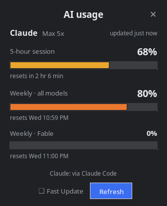

# AI Usage Monitor

**See your AI plan usage at a glance, right from your system tray, with no browser tab.**

Claude today (5-hour session, weekly, and per-model weekly limits). OpenAI Codex and
Google Gemini are next. Formerly *Claude Usage Monitor*.

<p align="center">
  
  
  
  
  
</p>

<p align="center">
  
</p>

> Shows **plan limits** (the percentages Claude shows you), not API dollars.

| Platform | Status |
|----------|--------|
| **Linux** (X11: XFCE, and other desktops with a systray) | ✅ Branch `linux-multi-ai` |
| **Windows** | v1 installer on [Releases](https://github.com/jj70785/claude-usage-monitor/releases/latest); v2 re-test next |
| **macOS** | Runs from source (v1); v2 re-test planned |

---

## What you get

- **One tray icon per AI.** A ring fills up and turns green → yellow → red with that AI's
  most-used limit, with the percentage in the middle. It grays out when the data is old.
- **Hover** for every limit and its reset time. **Left-click** for the flyout. **Right-click**
  for the menu (Quick view, Open window, Refresh now, Start on login, Quit).
- **A movable window** you can pin on top.
- **Desktop notifications** at 80% and 95% (once per limit per window; can be turned off).
- **Live while you work:** it notices every time Claude Code checks usage, at no cost.

## Install (Linux)

```sh
sudo apt install python3-tk python3-gi gir1.2-gtk-3.0 python3-pil
git clone -b linux-multi-ai https://github.com/jj70785/claude-usage-monitor.git
cd claude-usage-monitor
python3 -m claude_usage_monitor --install   # adds "AI Usage Monitor" to your app menu
python3 -m claude_usage_monitor             # start it (tray icon + window)
```

Then turn on **Start on login** from the tray icon's right-click menu. Wayland isn't
supported yet (the tray icon needs X11; see the [roadmap](docs/plans/roadmap.md)).

**Requirement:** [Claude Code](https://claude.com/claude-code), logged in with your Pro
or Max plan. That's where the numbers come from.

## How it works (Claude)

The app **asks Claude Code itself**: it starts `claude` in a special mode, sends one
`get_usage` request (no prompt, so it costs nothing), and reads the answer. Claude Code
handles its own login.
[Why](docs/decisions/0002-claude-get-usage-primary.md).

Backups, in order: Anthropic's usage endpoint using Claude Code's saved token (read-only;
can be turned off), then the usage snapshot Claude Code saves on disk, then (optional) your
[status-line hook](docs/statusline-hook.md).

### Safety and privacy

- **Stores no credentials.** Nothing to leak.
- **Never refreshes Claude Code's login token.** Those tokens are single-use; refreshing
  one from another app logs Claude Code out ([details](docs/decisions/0001-never-refresh-claude-tokens.md)).
- **Doesn't impersonate Claude Code**; it identifies itself honestly ([0003](docs/decisions/0003-honest-user-agent.md)).
- **Stays under the usage endpoint's rate limit** (auto refresh every 5 min, a small burst
  budget, and it backs off on 429).
- Logs contain percentages only: no tokens, no emails.

> ⚠️ It relies on an **undocumented** Anthropic endpoint and an **experimental** Claude
> Code feature. Either can change without notice; the app falls back gracefully. Not
> affiliated with Anthropic.

## Settings

`~/.config/ai-usage-monitor/prefs.json` (Linux) · `%APPDATA%\ClaudeUsageMonitor\prefs.json`
(Windows) · `~/Library/Application Support/ClaudeUsageMonitor/prefs.json` (macOS)

| key | default | meaning |
|-----|---------|---------|
| `auto_refresh_sec` | `300` | background refresh interval (minimum 120; Fast Update uses 90) |
| `notify_on_warn` | `true` | desktop notification when a limit crosses a threshold |
| `warn_threshold` / `crit_threshold` | `80` / `95` | notification thresholds (%) |
| `claude_api_fallback` | `true` | if `get_usage` fails, call the usage API with Claude Code's token (read-only) |
| `claude_cli_path` | `""` | path to `claude`, if it isn't found automatically |
| `start_on_login` | `false` | mirrors the tray "Start on login" toggle |
| `window_pinned` | `true` | pop-out window always on top |

## Windows / macOS (v1)

The Windows installer and macOS source run on [Releases](https://github.com/jj70785/claude-usage-monitor/releases/latest)
are **v1** (Claude only, two tray icons). v2 (this branch) ports both, but it hasn't
been re-tested on them yet. See [Phase 2/3](docs/plans/roadmap.md).

Building the Windows installer:

```sh
pip install -r requirements.txt pyinstaller
python build/make_icon.py
pyinstaller --noconfirm --clean --workpath build/_work --distpath dist build/monitor.spec
"%LOCALAPPDATA%\Programs\Inno Setup 6\ISCC.exe" build\installer.iss
```

## Docs

Plans, decisions, bugs, and research live in [docs/](docs/README.md). Developing:
[docs/dev/testing.md](docs/dev/testing.md) (`python3 -m unittest discover -s tests`).

## License

[MIT](LICENSE). Free to use, modify, and share.

*Not affiliated with or endorsed by Anthropic, OpenAI, or Google. "Claude" is a trademark
of Anthropic.*
