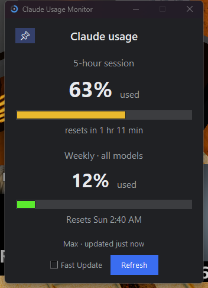
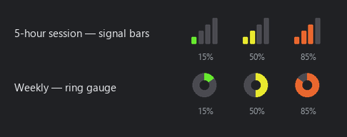
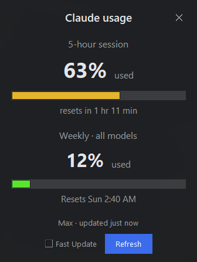

# Claude Usage Monitor

**See your Claude.ai plan usage at a glance — right from your system tray / menu bar, no browser needed.**

It shows your rolling **5-hour session** and your **weekly (all-models)** limits, colour-coded
green → yellow → red as you get close. Zero setup if you use Claude Code.

<p align="center">
  
  
  
  
</p>

<p align="center">
  
</p>

> Shows **plan limits**, not API pricing / dollars.

---

## What you get

**Two tray icons**, each coloured by its own level (green → yellow → red):

<p align="center"></p>

- 📶 **Signal bars** → 5-hour session
- ⭕ **Ring gauge** → weekly (all models)

**Left-click** either icon for a quick flyout; **right-click** for the menu. There's also a full
**movable window** you can pin always-on-top (open it from Windows Search / Start, or the menu).

<p align="center">
  
  &nbsp;&nbsp;
  
</p>

Every surface shows the bars, reset countdowns, a **Refresh** button, and a **Fast Update** toggle
(auto-refresh at the fastest safe rate).

---

## Install

### 🪟 Windows — one-click installer (easiest)
1. Download **`ClaudeUsageMonitor-Setup.exe`** from the [**Releases**](https://github.com/jj70785/claude-usage-monitor/releases/latest) page.
2. Run it (no admin needed). It adds Start-menu + desktop shortcuts and can start on login.
3. Look for the two icons in your system tray.

> First launch shows a one-time SmartScreen "unknown publisher" prompt (it's unsigned) — click
> **More info → Run anyway**.

### 🍎 macOS — menu bar
Native menu-bar support works (run from source for now; a packaged `.app`/`.dmg` is in progress — see [Roadmap](#roadmap)):
```sh
git clone https://github.com/jj70785/claude-usage-monitor.git && cd claude-usage-monitor
python3 -m venv .venv && source .venv/bin/activate
pip install -r requirements.txt
python -m claude_usage_monitor
```

### 🤖 With Claude Code (any OS) — let your AI install it
If you have [Claude Code](https://claude.com/claude-code), copy one of the [prompts below](#install-with-claude-code) and your AI sets it up for you.

### 🐍 From source (any OS)
```sh
pip install -r requirements.txt
python -m claude_usage_monitor        # shows the window; add --tray for tray/menu-bar only
```

---

## Install with Claude Code

Paste one of these into Claude Code and it'll do the whole thing.

**1) Quick run (Windows or macOS):**
```text
Set up and run the Claude Usage Monitor for me from https://github.com/jj70785/claude-usage-monitor :
1) git clone the repo and cd into it
2) create a venv, activate it, and `pip install -r requirements.txt`
3) run it with `python -m claude_usage_monitor`
It should appear in my system tray (Windows) or menu bar (macOS) and show my Claude plan usage. It
reads my Claude Code login automatically, so no setup is needed. Tell me whether it worked and how to
make it start automatically on login.
```

**2) Windows — build the one-click installer:**
```text
Build and install the Claude Usage Monitor on my Windows PC from
https://github.com/jj70785/claude-usage-monitor :
1) git clone the repo and cd into it
2) `pip install -r requirements.txt pyinstaller`
3) `python build/make_icon.py`
4) `pyinstaller --noconfirm --clean --workpath build/_work --distpath dist build/monitor.spec`
5) install Inno Setup if needed (`winget install JRSoftware.InnoSetup`), compile build\installer.iss
   with ISCC to produce installer_output\ClaudeUsageMonitor-Setup.exe, then run it to install.
Then confirm the two icons are in my system tray and that it starts on login.
```

---

## How it works

It reads the OAuth token that **Claude Code** already stores on your machine (Windows/Linux:
`~/.claude/.credentials.json`; macOS: the Keychain) and calls Anthropic's usage endpoint
`GET https://api.anthropic.com/api/oauth/usage`. Because Claude Code keeps that token fresh, there's
**zero setup** — no login, no cookie pasting.

No Claude Code? Use the tray menu's **"Paste session key…"** to paste your `claude.ai` `sessionKey`
cookie instead (stored securely in the OS keychain / Credential Manager).

> ⚠️ This uses an **undocumented** Anthropic endpoint (the same one Claude Code uses). It can change
> without notice; the app fails gracefully if it does. Not affiliated with Anthropic.

## Rate limiting

The endpoint allows only a short burst (~5 requests) then returns 429 with a ~5-minute lockout, and
retry-looping can flag your token. The app mirrors that with a **token bucket**: a quick burst, then
~1 refresh per 65s, with the Refresh button showing a live countdown. **Fast Update** auto-refreshes
at that safe sustained rate.

## Settings

`%APPDATA%\ClaudeUsageMonitor\prefs.json` (Windows) · `~/Library/Application Support/ClaudeUsageMonitor/prefs.json` (macOS):

| key                | default | meaning                                          |
|--------------------|---------|--------------------------------------------------|
| `auto_refresh_sec` | `300`   | background refresh interval (floor 65s)          |
| `warn_threshold`   | `80`    | % at which optional desktop notifications fire    |
| `notify_on_warn`   | `false` | desktop toast when a limit crosses the threshold  |
| `start_on_login`   | `false` | mirrors the tray "Start on login" toggle          |
| `window_pinned`    | `true`  | pop-out window always-on-top                     |
| `window_geometry`  | `""`    | remembered window position                       |

## Build the Windows installer

```sh
python build/make_icon.py                                                       # app icon (one-time)
pyinstaller --noconfirm --clean --workpath build/_work --distpath dist build/monitor.spec
"%LOCALAPPDATA%\Programs\Inno Setup 6\ISCC.exe" build\installer.iss              # -> installer_output\ClaudeUsageMonitor-Setup.exe
```

## Tech

Python · `pystray` (Windows/Linux tray) · native `NSStatusItem` via PyObjC (macOS menu bar) ·
`tkinter` UI · `requests`/stdlib `urllib` · packaged with PyInstaller + Inno Setup.

## Roadmap

- macOS `.app` / `.dmg` packaging (menu-bar app already works from source)
- Sonnet-only / Opus weekly bars, usage credits
- Low-limit desktop notifications on by default
- Linux packaging

## License

[MIT](LICENSE) — free to use, modify, and share.

*Not affiliated with or endorsed by Anthropic. "Claude" is a trademark of Anthropic.*
